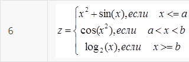
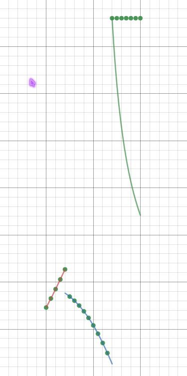

МИНИСТЕРСТВО НАУКИ  И ВЫСШЕГО ОБРАЗОВАНИЯ РОССИЙСКОЙ ФЕДЕРАЦИИ  
Федеральное государственное автономное образовательное учреждение высшего образования  
"КРЫМСКИЙ ФЕДЕРАЛЬНЫЙ УНИВЕРСИТЕТ им. В. И. ВЕРНАДСКОГО"  
ФИЗИКО-ТЕХНИЧЕСКИЙ ИНСТИТУТ  
Кафедра компьютерной инженерии и моделирования
<br/><br/>
### Отчёт по лабораторной работе № 2<br/> по дисциплине "Программирование"
<br/>
​
студента 1 курса группы 192(2)  
<br/>Кодаченко Никита Владимирович  
<br/>направления подготовки 09.03.04 "Программная инженерия" 

<br/><br/>
<table>
<tr><td>Научный руководитель<br/> старший преподаватель кафедры<br/> компьютерной инженерии и моделирования</td>
<td>(оценка)</td>
<td>Чабанов В.В.</td>
</tr>
</table>
<br/><br/>
​
Симферополь, 2019

#### Цель

* Овладеть практическими навыками разработки и программирования вычислительного процесса циклической структуры;
* Сформировать навыков программирования алгоритмов разветвляющейся структуры;
* Изучить операторы ветвления. Особенности использования полной и сокращенной формы оператора `if` и тернарного оператора.

#### Ход работы

Из таблицы была выбрана фукция .

1. Протабулируйте функцию и запишите получившиеся реультаты в отчёт в виде таблицы. При этом ***a*** = 0.7, ***b*** = 1.2, начала 
и конца интервала ***х<sub>нач</sub>*** = 0.5, ***x<sub>кон</sub>*** = 1.5 и шага ***d<sub>x</sub>*** = 0.05;
    
    | x | y |
    |---|---|
    |  0.5 | 0.729426 |
    |  0.55 | 0.825187 |
    |  0.6 | 0.924643 |
    |  0.65 | 1.02769 |
    |  0.7 | 1.13422 |
    |  0.75 | 0.845924 |
    |  0.8 | 0.802096 |
    |  0.85 | 0.750155 |
    |  0.9 | 0.689498 |
    |  0.95 | 0.61965 |
    |  1 | 0.540302 |
    |  1.05 | 0.451367 |
    |  1.1 | 0.353019 |
    |  1.15 | 0.245753 |
    |  1.2 | 3.80179 |
    |  1.25 | 3.80179 |
    |  1.3 | 3.80179 |
    |  1.35 | 3.80179 |
    |  1.4 | 3.80179 |
    |  1.45 | 3.80179 |
    |  1.5 | 3.80179 |
    
2. Определите минимальное и максимальное значение функции на указанном интервале и запешите результаты в отчёт;
    
    Минимум: 0.245753,  максимум: 3.80179.
    
3. График функции 4 с нанесенными точками, которые получились в процессе табуляции, и точками минимума и максимума (рис. 1).
    
     (рис. 1)
    
#### Код программы
```cpp
#include <iostream>
#include <cstdlib>
#include <cmath>
using namespace std;
bool doubleEquals(double left, double right, double epsilon) {
    return (fabs(left - right) < epsilon);
}
bool doubleLess(double left, double right, double epsilon,
    bool orequal = false) {
    if (fabs(left - right) < epsilon) {
        // В рамках epsilon, так что считаются равными
        return (orequal);
    }
    return (left < right);

}
bool doubleGreater(double left, double right, double epsilon,
    bool orequal = false) {
    if (fabs(left - right) < epsilon) {
        // В рамках epsilon, так что считаются равными
        return (orequal);
    }
    return (left > right);
}
int main()
{
    float a, b, x0, x1, dx, x, xi, max, min;
    cin >> a >> b >> x0 >> x1 >> dx;
    x = x0;
    max = x0;
    min = x0;
    while (doubleLess(x, x1, .0001, true)) {
        if (doubleLess(x, a, .0001, true)) xi = x * x + sin(x);
        else if (doubleGreater(x, a, .0001) && doubleLess(x, b, .0001)) xi = cos(x * x);
        else if (doubleLess(x, b, .0001, true)) xi = log(2) / log(x);
        if (max < xi)max = xi;
        if (min > xi)min = xi;
        cout << xi << "    " << x << "\n";
        x += dx;
    }
    cout << "Max=" << max << "    Min=" << min;
    system("pause");
```

#### Вывод

в ходе лабораторной работы были получены такие навыки, как
* умение применять оператор ветвления и циклы;
* умение разработки и программирования вычислительного процесса циклической структуры;
* умение программирования алгоритмов разветвляющейся структуры.
